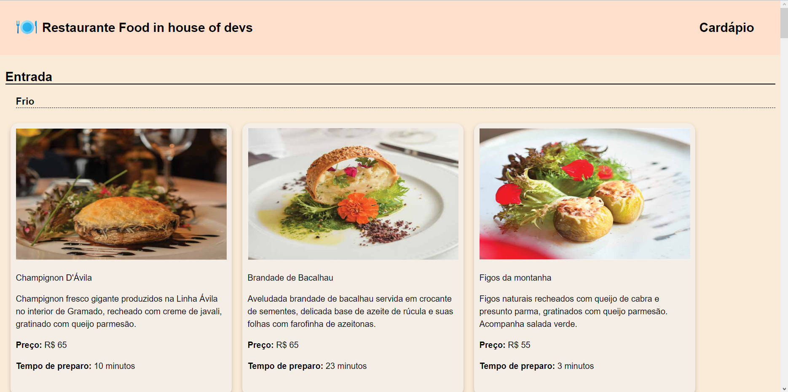
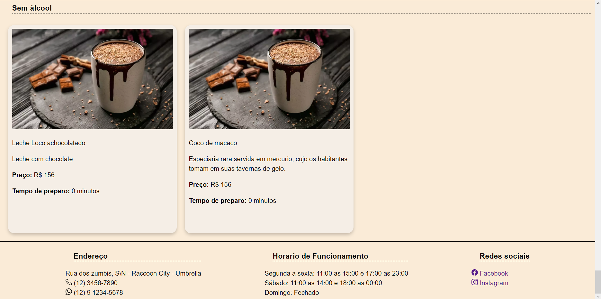

# Restaurante Food in house of devs

## Cardápio online do restaurante.

<h4 align="center"> 
	🚀 ... Concluido ... 🚀
</h4>

### Tecnologias usadas

<ul>
  <li>HTML</li>
  <li>CSS</li>
  <li>Javascript</li>
  <li>React</li>
  <li>Bootstrap-icons para React</li>
</ul>

### Itens

- [x] Header
- [x] Footer
- [x] Main
- [x] Cards
- [x] Componente de sessao de produtos
- [x] Sub-sessao de produtos

### Pré-requisitos

Para rodar o sistema sera necessario ter o nodejs instalado no micro.

### Baixar o repositorio
$ git clone <https://github.com/RDX777/M1S07DevInHouseExerciciosSenamais.git>

### Acesse a pasta
$ cd M1S07DevInHouseExerciciosSenamais

### Instale as dependências
$ npm install

### Execute a aplicação em modo de desenvolvimento
$ npm run dev

## Imagens do projeto

<h1 align="center">
  
</h1>

<h1 align="center">
  
</h1>